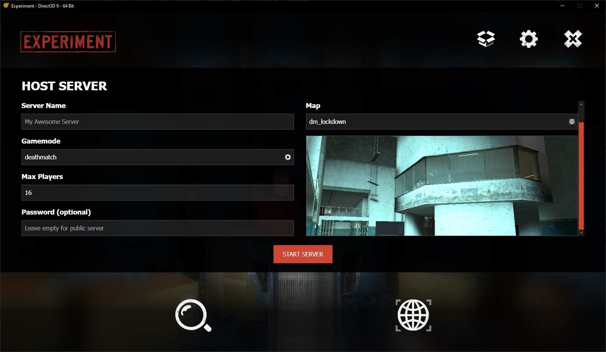

<div align="middle">


</div>

# Experiment: Source

An open-source platform for creating Source Engine mods with Lua, with compatibility for Garry's Mod scripts and addons.

> [!WARNING]
> This project is still in early development and is **not yet ready for use**.
> Additionally it is currently being worked on on-and-off, by a single developer.
>
> Given the current state of the project: please be aware that you will likely encounter **bugs and security issues**, **documentation may be incomplete or outdated**, and features may be missing or incomplete.
> Furthermore your contributions and issue reports are very welcome, but they **may not be responded to, reviewed or merged in a timely manner**.
>
> If you are interested in contributing, please feel free to [open an issue](https://github.com/experiment-games/experiment-source/issues) and/or create a pull request.
> If you are not sure where to start or what to do, start a discussion in the [Discussions](https://github.com/experiment-games/experiment-source/discussions) tab.

## 🐣 Origin

Initially this repository mainly worked towards creating a Source Engine mod
called "Experiment". It is a multiplayer mod that is based on the Source SDK 2013.
&raquo; [🕹 Read more about Experiment in the Garry's Mod gamemode repository](https://github.com/luttje/gmod-experiment-redux)

However during development an alternative idea that arose: that Experiment could
be used as a platform for creating Source Engine mods. This would allow developers
to create their own mods based on the Source SDK 2013, but without writing C++.
Instead mods could be created with Lua scripting and other features not present
in the original Source Engine SDK.
&raquo; [💡 Read more about Experiment as a platform in the Developer Portal](https://experiment-games.github.io/experiment-source)

## ✨ Features

- **Lua Scripting**: Write your mod in Lua, a powerful and easy-to-learn scripting language.
- **Garry's Mod compatibility**: Use Garry's Mod addons, gamemodes, scripts and binary modules in your mod.
- **Game Content mounting**: Mount content from other Source Engine games, like Half-Life 2, Counter-Strike: Source and more.

[&raquo; Visit the Developer Portal for our full Goals & Roadmap.](https://experiment-games.github.io/experiment-source/general/goals-and-roadmap/)

## 📸 Gallery

<details align="center">

<summary>View media</summary>

[](./docs/screenshot-mounting-game-content.jpg)&nbsp;
[](./docs/screenshot-start-server.jpg)&nbsp;

https://github.com/user-attachments/assets/9be0b481-3e7c-4acd-abbc-a1438f21e76c

</details>

## 🚀 Getting started

Please keep in mind that this project has been developed on Windows. It is possible that instructions may not work on other operating systems.

### Requirements

- Source SDK 2013 Multiplayer Base (Installed through Steam)
- Visual Studio 2022 (or newer)
- Visual Studio 2013 (for the Source SDK 2013 solution) ([`microsoft.com`](https://go.microsoft.com/fwlink/?LinkId=532504&type=ISO&clcid=0x409), [`archive.org mirror`](https://archive.org/details/en_visual_studio_community_2013_with_update_5_x86_dvd_6816332), [`alternative mirror`](https://mega.nz/file/Agw1zCyL#DhQtvdfir0CnusR2qMpGKxKx2LvnjhmWDhEcB029Dak))
- Perl (e.g. [Strawberry Perl](https://strawberryperl.com/))
- (Not required, but recommended) [Git Bash](https://git-scm.com/downloads) for running `bash` scripts

[&raquo; See the Source SDK 2013 documentation for more information.](https://developer.valvesoftware.com/wiki/Source_SDK_2013)

### Step-by-step

After (forking and) cloning the repository, follow these steps to setup the project:

1. Go into the `src/` directory and generate the Visual Studio solution.

    ```bash
    cd src
    creategameprojects.bat
    ```

2. Build the shaders

    ```bash
    cd src
    ./buildshaders.sh
    ```

3. Copy the `.env.example` file to `.env`.

    ```bash
    cp .env.example .env
    ```

4. Fill the `.env` file with the described values

5. Next run the `setupprojects.sh` script to modify the Visual Studio project files and solution.

    ```bash
    cd src
    ./setupprojects.sh --init
    ```

    _This script will:_
    * _Set up debugging in the Visual Studio `Client (Experiment)` project file_
    * _Enforces the correct project dependencies of all projects._
    * _The `--init` flag will cause all Source SDK 2013 executables and neccessary files to be copied to `game/`, so that the game can be run as a standalone mod._

6. Open the created `experiment.sln` solution in Visual Studio 2022 (or newer).

    > [!WARNING]
    > Despite building in Visual Studio 2022, the Source SDK 2013 solution requires Visual Studio 2013 to be installed.

7. To setup the game mod directory, run this in the root directory of the repository:

    ```bash
    ./tools/setup-game.sh
    ```

    _This setups up a `settings.scr` file based on an example that is in this repository._

8. Make sure Steam is running and start the game through the `Client (Experiment)` project.

9. If you want to try out Garry's Mod sandbox:

    - Make sure that Garry's Mod is installed through Steam
    - Start Experiment
    - Mount Garry's Mod through the main menu
    - Restart Experiment
    - When starting a new server, select the `sandbox` gamemode

> [!NOTE]
> Some of the instructions above may (no longer) be necessary, but they are included since at some point during development they were found to be necessary.

## 📚 Documentation

We build and present the Experiment Developer Documentation using [mkdocs-material](https://squidfunk.github.io/mkdocs-material/).

- [📕 View Lua API Documentation](https://experiment-games.github.io/experiment-source)
- [👓 Read our conventions](https://experiment-games.github.io/experiment-source/general/conventions/)

### Building the documentation

#### Requirements

- Python 3.8 or newer

#### Installation

1. Install the required Python packages.

    ```bash
    pip install -r requirements.txt
    ```

2. Start the development server.

    ```bash
    mkdocs serve --dirty
    ```

    Compiling the documentation will take **a couple minutes**.

    _The `--dirty` flag is used to make live-reloading only rebuild the changed_
    _files, rather than the entire site. This is useful for faster development (see also [issue #3695 in the mkdocs repo](https://github.com/mkdocs/mkdocs/issues/3695))._

3. Open the documentation in your browser @ [http://localhost:8000/experiment-source/]

## 🏸 Extras

<details>

<summary>Updating from Source SDK 2013</summary>

1. Switch to the `master` branch.

    ```bash
    git checkout master
    ```

2. Ensure that the upstream repository is added as a remote.

    ```bash
    git remote add upstream https://github.com/ValveSoftware/source-sdk-2013
    git remote set-url --push upstream DISABLE
    ```

3. Fetch the latest changes from the upstream repository.

    ```bash
    git fetch upstream
    ```

4. Merge the changes from the upstream repository into the `master` branch.

    ```bash
    git merge upstream/master
    ```

5. Resolve any merge conflicts, if necessary.

6. Push the changes to this forked repository.

    ```bash
    git push origin master
    ```

7. Switch to the `experiment-main` branch.

    ```bash
    git checkout experiment-main
    ```

8. Merge the changes from the `master` branch into the `experiment-main` branch.

    ```bash
    git merge master
    ```
</details>

<details>

<summary>Attaching the debugger manually</summary>

This should not be necessary if you've run the `setupprojects.sh` script.

More instructions can be found here: [check the official docs and use values like this:](https://developer.valvesoftware.com/wiki/Installing_and_Debugging_the_Source_Code)

Setup the debugger with the following values:
> - Command: `C:\Program Files %28x86%29\Steam\steamapps\common\Source SDK Base 2013 Multiplayer\hl2.exe`
> - Command Arguments: `-allowdebug -dev -sw -game "C:\Program Files (x86)\Steam\steamapps\sourcemods\experiment"`
> - Working Directory: `C:\Program Files %28x86%29\Steam\steamapps\common\Source SDK Base 2013 Multiplayer`

</details>
